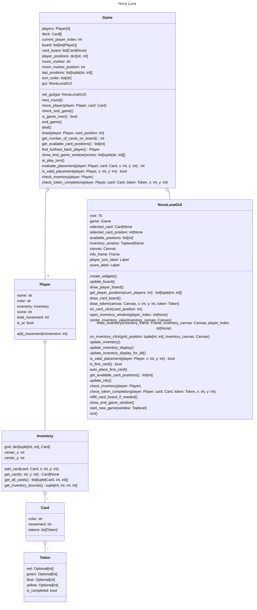

```mermaid
---
title: Nova Luna
---
classDiagram

class Game {
    players: Player[4]
    deck: Card[]
    current_player_index: int
    board: list[list[Player]]
    card_board: list[Card|None]
    player_positions: dict[str, int]
    moon_marker: str
    moon_marker_position: int
    last_positions: list[tuple[str, int]]
    turn_order: list[str]
    gui: NovaLunaGUI
    set_gui(gui: NovaLunaGUI)
    next_round()
    move_player(player: Player, card: Card)
    check_end_game()
    is_game_over() bool
    end_game()
    deal()
    draw(player: Player, card_position: int)
    get_number_of_cards_on_board() int
    get_available_card_positions() list[int]
    find_furthest_back_player() Player
    show_end_game_window(scores: list[tuple[str, int]])
    ai_play_turn()
    evaluate_placement(player: Player, card: Card, x: int, y: int) int
    is_valid_placement(player: Player, x: int, y: int) bool
    check_inventory(player: Player)
    check_token_completion(player: Player, card: Card, token: Token, x: int, y: int)
}

class Player {
    name: str
    color: str
    inventory: Inventory
    score: int
    total_movement: int
    is_ai: bool
    add_movement(movement: int)
}
Game o-- "4" Player

class Inventory {
    grid: dict[tuple[int, int], Card]
    center_x: int
    center_y: int
    add_card(card: Card, x: int, y: int)
    get_card(x: int, y: int) Card|None
    get_all_cards() list[tuple[Card, int, int]]
    get_inventory_bounds() tuple[int, int, int, int]
}
Player o-- Inventory

class Card {
    color: str
    movement: int
    tokens: list[Token]
}
Inventory o-- "*" Card

class Token {
    red: Optional[int]
    green: Optional[int]
    blue: Optional[int]
    yellow: Optional[int]
    is_completed: bool
}
Card o-- "*" Token

class NovaLunaGUI {
    root: Tk
    game: Game
    selected_card: Card|None
    selected_card_position: int|None
    available_positions: list[int]
    inventory_window: Toplevel|None
    canvas: Canvas
    info_frame: Frame
    player_turn_label: Label
    score_label: Label
    create_widgets()
    update_board()
    draw_player_board()
    get_player_positions(num_players: int) list[tuple[int, int]]
    draw_card_board()
    draw_token(canvas: Canvas, x: int, y: int, token: Token)
    on_card_click(card_position: int)
    open_inventory_window(player_index: int|None)
    center_inventory_view(inventory_canvas: Canvas)
    draw_inventory(inventory_frame: Frame, inventory_canvas: Canvas, player_index: int|None)
    on_inventory_click(grid_position: tuple[int, int], inventory_canvas: Canvas)
    update_inventory()
    update_inventory_display()
    update_inventory_display_for_all()
    is_valid_placement(player: Player, x: int, y: int) bool
    is_first_card() bool
    auto_place_first_card()
    get_available_card_positions() list[int]
    update_info()
    check_inventory(player: Player)
    check_token_completion(player: Player, card: Card, token: Token, x: int, y: int)
    refill_card_board_if_needed()
    show_end_game_window()
    start_new_game(window: Toplevel)
    run()
}
Game o-- NovaLunaGUI

```
