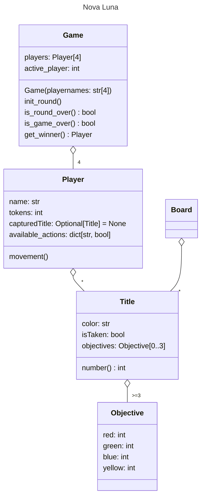

```mermaid
---
title: Nova Luna
---
classDiagram

class Game {
    players: Player[4]
    active_player: int
    Game(playernames: str[4])
    init_round()
    is_round_over() bool
    is_game_over() bool
    get_winner() Player
}

class Player {
    name: str
    tokens: int
    capturedTitle: Optional[Title] = None
    available_actions: dict[str, bool]
    movement()
}
Game o-- "4" Player

class Title {
    color: str
    isTaken: bool
    objectives: Objective[0..3]
    number() int
}
Player o-- "*" Title

class Board

class Objective {
    red: int
    green: int
    blue: int
    yellow: int
}
Board o-- "*" Title
Title o-- ">=3" Objective

```
